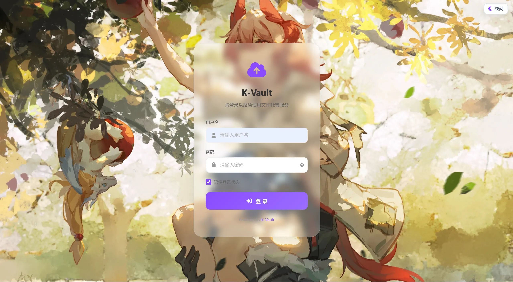
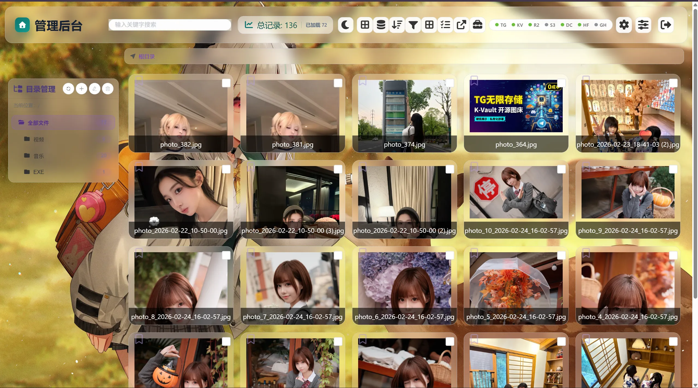
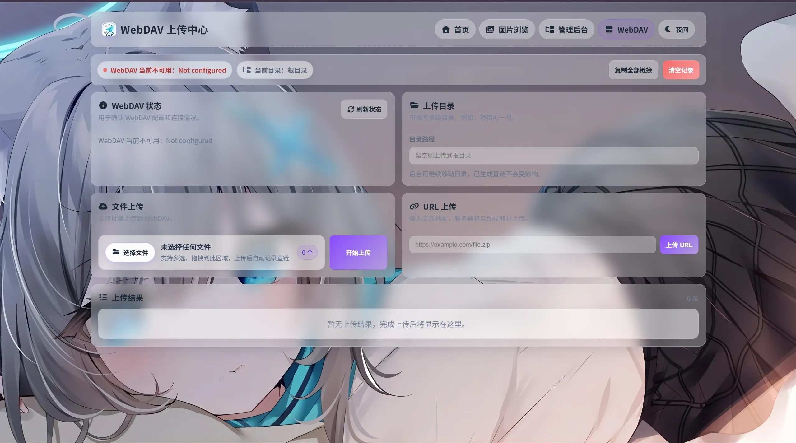

<div align="center">


# K-Vault

> Free image/file hosting solution deployed on **Cloudflare Pages**, compatible with Telegram, R2, S3, Discord, HuggingFace, WebDAV, and GitHub storage backends.

**English** | [中文](README.md)

<br>


</div>

---

## Screenshots

<p align="center">
   
   
   
</p>
<p align="center">
   
   
</p>

## Features

- **Unlimited Storage** - Upload unlimited images and files
- **Completely Free** - Hosted on Cloudflare, zero cost within the free quota
- **Free Domain** - Uses `*.pages.dev` subdomain, and also supports custom domains
- **Multiple Storage Backends** - Supports Telegram, Cloudflare R2, S3-compatible storage, Discord, HuggingFace, WebDAV, and GitHub
- **Telegram Webhook Backlink** - Bot can automatically reply with direct links after receiving files in channels/groups
- **KV Write Optimization** - Telegram can use signed direct links to significantly reduce KV read/write usage
- **Content Moderation** - Optional image moderation API to automatically block inappropriate content
- **Multi-format Support** - Images, videos, audio, documents, archives, and more
- **Online Preview** - Supports preview for images, videos, audio, and documents (pdf, docx, txt)
- **Chunked Upload** - Supports files up to 100MB (with R2/S3)
- **Guest Upload** - Optional guest upload with file size and daily upload limits
- **Multiple Views** - Grid and list management views
- **Storage Classification** - Clearly distinguishes files from different storage backends
- **Single Deployment Mode** - Cloudflare Pages only (static root pages + Pages Functions), with no build step
- **API Tokens** - Isolated from the web session, with `upload` / `read` / `delete` / `paste` scopes, rotation, and per-token policies
- **Text Paste (Pastebin)** - Create / list / view / delete text pastes with language tag, expiry, and access password
- **Share Options on Web Upload** - Set `expires_in`, `password`, `max_downloads`, and a custom `slug` (`/s/<slug>`) from the upload drawer
- **Simplified Frontend** - Root pages remain the primary UX for upload/admin deployment.
- **GitHub Actions** - Cloudflare Pages deployment notes and CI test workflows only

### 2026-03 Product Update

- Admin and folder console are now on root page (`/admin.html`) with:
  - folder tree + breadcrumbs
  - file/folder operations (create, rename, move, delete, batch actions)
  - drag upload queue (progress, retry, cancel)
  - direct link copy (signed `/share/:id` links are **not** part of the Pages deployment; only the retained Node runtime implements them)
- Storage capability cards now keep all adapters visible (configured or not) with explicit status/hints.
- Existing direct links (`/file/:id`) remain compatible.

### Cloudflare Pages (No Build Step)

A lightweight workflow note is included in `.github/workflows/pages-deploy.yml`.

- No Cloudflare API secrets are required in this repository by default.
- Recommended deployment path is Cloudflare Pages Git integration (connect your fork directly in Cloudflare Dashboard).
- Leave Build command and Build output directory empty. K-Vault serves the root static pages plus `functions/`; `frontend/dist` is not part of the current Pages deployment.
- If you want CLI deployment, run Wrangler locally with your own credentials.

Recommended architecture for multi-cloud mounts:

- Use `WebDAV` adapter in K-Vault as a mounted entry.
- Use `alist/openlist` as aggregation layer for other providers.
- This keeps K-Vault focused on UX/link/auth while reducing adapter maintenance complexity.

---

## Deployment

K-Vault provides a single deployment form:

| Form | How it runs | Best for |
| :--- | :--- | :--- |
| **Cloudflare Pages** | Static root pages + `functions/` Pages Functions | Zero cost within the free quota, edge acceleration, globally available |

> Docker / Nginx self-hosted deployment has been removed from this repository. The `server/` directory is retained as upstream Node runtime source (for reference and further development) and is **no longer a supported deployment target**; its exclusive capabilities (dynamic storage config management, audit log query, signed share links) are unavailable on the Cloudflare Pages deployment.

This deployment form exposes the following main entrypoints:

- Upload UI: `/`
- Admin console: `/admin.html`
- WebDAV page: `/webdav.html`
- Admin/API routes: `/api/*`
- Browser upload: `POST /upload`
- API Token upload: `/api/v1/upload`
- Direct/share links: `/file/*`, `/share/*`, `/s/*`

### Cloudflare Pages Deployment

Use this when you want Cloudflare-hosted static pages, Pages Functions, KV, and R2.

1. **Fork this repository**

2. **Create a Pages project**
   - Log in to [Cloudflare Dashboard](https://dash.cloudflare.com)
   - Go to `Workers and Pages` -> `Create Application` -> `Pages` -> `Connect to Git`
   - Select the forked repository
   - Use these build settings:

| Item | Value |
| :--- | :--- |
| Framework preset | `None` |
| Root directory | Empty (repository root) |
| Install command | Empty |
| Build command | Empty |
| Build output directory | Empty |
| Deploy command | Empty |

3. **Bind KV**
   - Open Cloudflare Dashboard -> `Workers and Pages` -> `KV`
   - Create a namespace, for example `k-vault`
   - Open the Pages project -> `Settings` -> `Functions` -> `KV namespace bindings`
   - The binding variable name must be `img_url`

4. **Configure at least one storage backend**
   - Go to project `Settings` -> `Environment variables`
   - Telegram example:

| Variable | Description | Required |
| :--- | :--- | :---: |
| `TG_Bot_Token` | Telegram Bot Token | Yes |
| `TG_Chat_ID` | Telegram channel ID | Yes |
| `BASIC_USER` | Admin username (the management API fails closed with 503 when unset) | Optional |
| `BASIC_PASS` | Admin password (same as above) | Optional |

You can also use R2, S3-compatible storage, Discord, HuggingFace, WebDAV, or GitHub. See the Storage Configuration section below for backend-specific variables.

5. **Redeploy**
   - Environment variable or binding changes require a new deployment.
   - Visit `/api/status` and confirm the expected storage and KV/R2 status.

Common Pages mistakes:

- Do not set Deploy command to `npx wrangler deploy`; that is a Workers command, not a Pages command.
- Do not set Build command to `npm run build`.
- Do not set Build output directory to `dist` or `frontend/dist`.
- If R2 binding deployment fails with `invalid jurisdiction`, follow [Cloudflare Pages R2 binding troubleshooting](docs/cloudflare-pages-r2.md).

### WebDAV Validation

After deployment, run at least one WebDAV smoke check to verify the full flow: config test -> upload -> download -> delete.

Validation criteria:

- `webdav.connected` in `/api/status` must be `true`
- WebDAV `upload / download / delete` exercised from the WebDAV page (`/webdav.html`) must all pass

> This repository no longer ships a standalone storage regression runner: it was removed together with the Docker self-hosted deployment path. Storage connectivity is validated through `/api/status` and the WebDAV page instead.

---

## Storage Configuration

### Telegram Enhanced Mode (Self-hosted Bot API + Webhook)

This project supports switching the Telegram API base URL to a self-hosted Bot API and replying with direct links automatically via Webhook when files are received in groups/channels.

**Key environment variables:**

| Variable | Description | Example |
| :--- | :--- | :--- |
| `CUSTOM_BOT_API_URL` | Self-hosted Bot API URL (defaults to `https://api.telegram.org` if not set) | `http://127.0.0.1:8081` |
| `PUBLIC_BASE_URL` | Public domain used for Webhook backlink replies (recommended) | `https://img.example.com` |
| `TG_WEBHOOK_SECRET` | Webhook secret, verified by header `X-Telegram-Bot-Api-Secret-Token` | `your-secret` |
| `TELEGRAM_LINK_MODE` | Telegram link mode; set `signed` to enable signed direct links | `signed` |
| `MINIMIZE_KV_WRITES` | Set `true` to enable low-KV-write mode (also enables signed direct links) | `true` |
| `TELEGRAM_METADATA_MODE` | Telegram metadata write mode: `off` disables admin index writes; lightweight index is default | `off` |
| `TG_UPLOAD_NOTIFY` | Whether to send extra "direct link + File ID" notification after web upload succeeds | `true` |
| `FILE_URL_SECRET` | Signed direct-link secret (falls back to `TG_Bot_Token` if unset) | `random-long-secret` |

**Webhook deployment steps:**

1. Add the bot to the target channel/group on Telegram and grant permission to post (admin recommended for channels).
2. Set `TG_Bot_Token`, `PUBLIC_BASE_URL`, and `TG_WEBHOOK_SECRET` in Cloudflare Pages, then redeploy.
3. Call `setWebhook` and point to this project endpoint: `https://your-domain/api/telegram/webhook`.
4. Send images/files in the channel/group, and the bot will auto-reply with `/file/...` direct links.

**`setWebhook` example (official API):**

```bash
curl -X POST "https://api.telegram.org/bot<YOUR_BOT_TOKEN>/setWebhook" \
  -H "Content-Type: application/json" \
  -d "{\"url\":\"https://img.example.com/api/telegram/webhook\",\"secret_token\":\"<YOUR_SECRET>\",\"allowed_updates\":[\"message\",\"channel_post\"]}"
```

**`setWebhook` example (self-hosted Bot API):**

```bash
curl -X POST "http://127.0.0.1:8081/bot<YOUR_BOT_TOKEN>/setWebhook" \
  -H "Content-Type: application/json" \
  -d "{\"url\":\"https://img.example.com/api/telegram/webhook\",\"secret_token\":\"<YOUR_SECRET>\",\"allowed_updates\":[\"message\",\"channel_post\"]}"
```

> **About 2GB files:**  
> With a self-hosted Bot API (`CUSTOM_BOT_API_URL`), when files are sent directly from a Telegram client to a group/channel and returned via Webhook links, you can use the Bot API large-file capability (commonly up to 2GB).  
> But the web upload path is still constrained by current frontend strategy and Cloudflare request size limits (see "Usage Limits" below), so it is not equivalent to direct 2GB upload from the web UI.
>
> **Note:** Downloading files through a self-hosted Bot API first caches files on local disk. Reserve enough space and monitor I/O.

### Telegram Low-KV-Write Mode (Optional)

If you are concerned about Cloudflare KV daily quota usage, you can enable:

- `TELEGRAM_LINK_MODE=signed` (signed direct links for Telegram files only)
- Or `MINIMIZE_KV_WRITES=true` (also affects chunked upload task write strategy)

After enabling this, Telegram files still write a lightweight KV index by default (for admin list and management operations). Downloads resolve `file_id` through signed parameters, reducing KV read/write pressure. With `TELEGRAM_METADATA_MODE=off`, signed Telegram uploads skip the post-upload KV metadata lookup: `password`, `expires_in`, `max_downloads`, and `slug` are ignored, and the response has no delete link. With `MINIMIZE_KV_WRITES=true`, API Token validation still reads KV, but writes `lastUsedAt` only on first use and then at least one hour apart.

> **Optional tradeoff:** If you want Telegram files to skip KV writes entirely, also set `TELEGRAM_METADATA_MODE=off`. In this mode, files will not appear in the admin list, and tag/allowlist/denylist/delete flows that rely on KV metadata will be unavailable.

### KV Storage (Required for Image Management)

To enable image management, configure KV:

1. Go to Cloudflare Dashboard -> `Workers and Pages` -> `KV`
2. Click `Create namespace`, name it `k-vault`
3. Go to your Pages project -> `Settings` -> `Functions` -> `KV namespace bindings`
4. Add binding: variable name `img_url`, choose the namespace you created
5. Redeploy the project

### R2 Storage (Large File Support, Optional)

Configure R2 to support uploads up to 100MB:

1. **Create a bucket**
   - Cloudflare Dashboard -> `R2 Object Storage` -> `Create bucket`
   - Name it `k-vault-files`

2. **Bind to the project**
   - Pages project -> `Settings` -> `Functions` -> `R2 bucket bindings`
   - Variable name `R2_BUCKET`, choose your bucket

3. **Enable R2**
   - `Settings` -> `Environment variables` -> add `USE_R2` = `true`
   - Redeploy

> If redeploy fails with `binding R2_BUCKET of type r2_bucket contains an invalid jurisdiction`, Cloudflare Pages is rejecting the R2 binding metadata before K-Vault code runs. Normal R2 buckets should not set `jurisdiction`; only residency-restricted buckets use `eu` or `fedramp`. Follow [Cloudflare Pages R2 binding troubleshooting](docs/cloudflare-pages-r2.md) to rebuild Production/Preview bindings, or run `npm run pages:r2:doctor -- --check` to validate `wrangler.jsonc`.

### S3-Compatible Storage (Optional)

Supports any S3-compatible object storage service, including AWS S3, MinIO, BackBlaze B2, Alibaba Cloud OSS, etc.

**Environment variables:**

| Variable | Description | Example |
| :--- | :--- | :--- |
| `S3_ENDPOINT` | S3 service endpoint URL | `https://s3.us-east-1.amazonaws.com` |
| `S3_REGION` | Region | `us-east-1` |
| `S3_ACCESS_KEY_ID` | Access Key ID | `AKIA...` |
| `S3_SECRET_ACCESS_KEY` | Secret Access Key | `wJalr...` |
| `S3_BUCKET` | Bucket name | `my-filebed` |

**Endpoint examples by provider:**

| Provider | Endpoint format | Region |
| :--- | :--- | :--- |
| AWS S3 | `https://s3.{region}.amazonaws.com` | `us-east-1` etc. |
| MinIO | `https://minio.example.com:9000` | `us-east-1` |
| BackBlaze B2 | `https://s3.{region}.backblazeb2.com` | `us-west-004` etc. |
| Alibaba Cloud OSS | `https://oss-{region}.aliyuncs.com` | `cn-hangzhou` etc. |
| Cloudflare R2 | `https://{account_id}.r2.cloudflarestorage.com` | `auto` |

**Deployment steps:**

1. Create a bucket in your S3 provider
2. Get Access Key ID and Secret Access Key
3. Add the environment variables above in your Cloudflare Pages project
4. Redeploy, and the frontend will automatically show S3 storage options

### Discord Storage (Optional)

Store files through a Discord channel, supporting both Webhook and Bot modes.

> **Note:** Discord attachment URLs expire after about 24 hours. This project provides downloads through a proxy and refreshes URLs automatically per request. The current version prioritizes Bot message lookup and falls back to Webhook lookup on failure. If both Bot and Webhook are configured, ensure the Bot has read access to the Webhook channel.

**Environment variables:**

| Variable | Description | Required |
| :--- | :--- | :---: |
| `DISCORD_WEBHOOK_URL` | Discord Webhook URL (recommended for uploads) | One of two |
| `DISCORD_BOT_TOKEN` | Discord Bot Token (for fetching and deleting files) | Recommended |
| `DISCORD_CHANNEL_ID` | Discord channel ID (required for Bot-mode upload) | Bot mode |

**Webhook deployment (recommended):**

1. In your Discord server, go to channel settings -> Integrations -> Webhooks
2. Create a new Webhook and copy the Webhook URL
3. Add environment variable `DISCORD_WEBHOOK_URL` in Cloudflare Pages
4. (Recommended) Also create a Discord Bot and set `DISCORD_BOT_TOKEN` for file retrieval and deletion
5. Redeploy

**Bot deployment:**

1. Go to [Discord Developer Portal](https://discord.com/developers/applications) and create an application
2. Create a Bot in the Bot tab and get the token
3. In OAuth2 -> URL Generator, select `bot` scope and grant `Administrator` permission to the Bot
4. Use the generated URL to invite the Bot to your server
5. Add `DISCORD_BOT_TOKEN` and `DISCORD_CHANNEL_ID` in Cloudflare Pages
6. Redeploy

**Troubleshooting (`File not found on Discord`):**

1. Ensure the channel pointed to by `DISCORD_WEBHOOK_URL` is also accessible by the Bot (channel mismatch can cause upload success but direct link failure).
2. Grant the Bot `Administrator` permission directly to avoid read failures from missing channel permissions.
3. You must redeploy Cloudflare Pages after changing environment variables (saving variables alone does not apply immediately).
4. Open `/api/status` and check whether Discord status is `bot`, `webhook`, or `bot+webhook`.

**Limits:**
- Non-Boosted server: 25MB/file
- Level 2 Boost: 50MB/file
- Level 3 Boost: 100MB/file

### HuggingFace Storage (Optional)

Use HuggingFace Datasets API to store files. Files are saved to a Dataset repository as git commits.

**Environment variables:**

| Variable | Description | Example |
| :--- | :--- | :--- |
| `HF_TOKEN` | HuggingFace token with write access | `hf_xxxxxxxxxxxx` |
| `HF_REPO` | Dataset repository ID | `username/my-filebed` |

**Deployment steps:**

1. Register a [HuggingFace](https://huggingface.co) account
2. Create a new Dataset repository (Settings -> New Dataset)
3. Go to [Settings -> Access Tokens](https://huggingface.co/settings/tokens) and create a token (requires Write permission)
4. Add `HF_TOKEN` and `HF_REPO` environment variables in Cloudflare Pages
5. Redeploy

**Limits:**
- Regular upload (base64): about 35MB/file
- LFS upload: up to 50GB/file
- Total free-tier repository size: about 50GB

---

## Guest Upload Feature

Allows non-logged-in users to upload files. Site owners can configure whether it is enabled and apply restriction rules.

| Variable | Description | Default |
| :--- | :--- | :--- |
| `GUEST_UPLOAD` | Enable guest upload | `false` |
| `GUEST_MAX_FILE_SIZE` | Max guest single-file size (bytes) | `5242880` (5MB) |
| `GUEST_DAILY_LIMIT` | Guest daily upload limit (by IP) | `10` |

**How to enable:**

1. Set `GUEST_UPLOAD` = `true` in environment variables
2. Adjust `GUEST_MAX_FILE_SIZE` and `GUEST_DAILY_LIMIT` as needed
3. Ensure `BASIC_USER` and `BASIC_PASS` are configured (otherwise guest/admin cannot be distinguished)
4. Redeploy

**Feature behavior:**
- Guests can upload directly from the homepage without login
- Guest uploads are limited by single-file size and daily count
- Guests cannot use chunked uploads or advanced storage options (S3/Discord/HuggingFace)
- Guests cannot access the admin panel or gallery page
- Limits are based on guest IP address and reset daily

---

## Advanced Configuration

| Variable | Description | Default |
| :--- | :--- | :--- |
| `ModerateContentApiKey` | Image moderation API key (from [moderatecontent.com](https://moderatecontent.com)) | - |
| `WhiteList_Mode` | Whitelist mode, only whitelisted images can be loaded | `false` |
| `USE_R2` | Enable R2 storage | `false` |
| `CUSTOM_BOT_API_URL` | Telegram API base URL (supports self-hosted Bot API) | `https://api.telegram.org` |
| `PUBLIC_BASE_URL` | Public domain used for Webhook backlinks | Current request domain |
| `TG_WEBHOOK_SECRET` | Telegram Webhook secret (also compatible with `TELEGRAM_WEBHOOK_SECRET`) | - |
| `TELEGRAM_LINK_MODE` | Telegram link mode (`signed` for signed direct links) | - |
| `MINIMIZE_KV_WRITES` | Reduce KV writes (also enables signed direct links) | `false` |
| `TELEGRAM_METADATA_MODE` | Telegram metadata write mode (`off` disables admin index writes) | `on` |
| `TG_UPLOAD_NOTIFY` | Send "direct link + File ID" notification after web upload succeeds | `true` |
| `FILE_URL_SECRET` | Signed direct-link secret (also compatible with `TG_FILE_URL_SECRET`) | `TG_Bot_Token` |
| `CHUNK_BACKEND` | Chunk temporary storage backend (`auto`/`r2`/`kv`) | `auto` |
| `disable_telemetry` | Disable telemetry | - |

### Retained Node Runtime Variables (`server/`, Not a Deployment Target)

> These variables belong to the retained upstream Node runtime source under `server/`. That runtime is kept for reference and further development only and is **not a supported deployment target**; none of these variables affect the Cloudflare Pages deployment.

| Variable | Description | Default |
| :--- | :--- | :--- |
| `PORT` | API service port of the retained Node runtime | `8787` |
| `DATA_DIR` | Data directory | `/app/data` |
| `DB_PATH` | SQLite database path | `/app/data/k-vault.db` |
| `CHUNK_DIR` | Chunk temp directory | `/app/data/chunks` |
| `CONFIG_ENCRYPTION_KEY` | Required key for encrypting storage config secrets | - |
| `SESSION_SECRET` | Session/signing secret (recommended, separate from encryption key) | - |
| `UPLOAD_MAX_SIZE` | Max upload size in bytes | `104857600` |
| `UPLOAD_SMALL_FILE_THRESHOLD` | Threshold for direct upload vs chunk strategy | `20971520` |
| `CHUNK_SIZE` | Chunk upload size in bytes | `5242880` |
| `DEFAULT_STORAGE_TYPE` | Bootstrap default storage type (`telegram`/`r2`/`s3`/`discord`/`huggingface`) | `telegram` |
| `SETTINGS_STORE` | Basic app settings backend (`sqlite` or `redis`) | `sqlite` |
| `SETTINGS_REDIS_URL` | Redis URL for Upstash/Redis/KVrocks (required when `SETTINGS_STORE=redis`) | - |
| `SETTINGS_REDIS_PREFIX` | Redis key prefix for settings hash | `k-vault` |
| `SETTINGS_REDIS_CONNECT_TIMEOUT_MS` | Redis connect/ping timeout in milliseconds | `5000` |
| `WEB_PORT` | Public web port of the retained Node runtime | `8080` |

---

## Pages

| Page | Path | Description |
| :--- | :--- | :--- |
| Home/Upload | `/` | Batch upload, drag-and-drop, paste upload; the upload drawer can set expiry / password / download limit / custom short link |
| Admin Panel | `/admin.html` | File management, folder tree, favorites, storage status, **API Token management** |
| Text Paste | `/paste.html` | Pastebin: create / list / view / delete, with language tag, expiry, and access password |
| WebDAV Page | `/webdav.html` | Dedicated WebDAV upload page with root-style UI |
| Gallery | `/gallery.html` | Image grid browsing |
| File Preview | `/preview.html` | Multi-format file preview; password-protected files prompt for the password inline |
| Login Page | `/login.html` | Admin login |
| Intercept Notice | `/block-img.html`, `/whitelist-on.html` | Blacklist / whitelist mode notice pages |

---

## Directory Structure

```
├── index.html                  # Home / upload (share settings drawer)
├── admin.html                  # Admin console (rewritten, with API Token management panel)
├── paste.html                  # Text paste (Pastebin) frontend
├── gallery.html                # Image gallery (rewritten)
├── webdav.html / preview.html / login.html
├── theme.css / theme.js        # Theme and site-wide UI design config
├── functions/                  # Cloudflare Pages Functions backend
│   ├── api/                    # auth / manage (incl. paste) / admin / v1 / chunked-upload ...
│   ├── file/[id].js            # Direct links, block/whitelist, password / expiry / download-limit checks
│   ├── utils/share-options.js  # Shared implementation of expiry / password / download limit / short link
│   └── s/[slug].js             # Short share links
├── server/                     # Upstream Node runtime (Hono) source retained, not a deployment target
│   ├── app.js                  # All routes
│   ├── lib/                    # Repository layer, storage adapters, auth, SSRF guard
│   └── db/                     # SQLite schema
├── test/                       # Tests (incl. deployment contract and Pages upload route regression)
├── docs/                       # OpenAPI, integration guide, full config reference
├── scripts/                    # Cloudflare Pages R2 binding troubleshooting
└── .github/workflows/          # Pages deployment notes and CI tests only
```

---

## Usage Limits

**Cloudflare free quota:**

- 100,000 requests/day
- KV: 1,000 writes/day, 100,000 reads/day, 1,000 list operations/day
- Upgrade to a paid plan if exceeded (starting from $5/month)
- For Telegram-heavy scenarios, signed direct links or low-KV-write mode are recommended to reduce quota pressure
- These Cloudflare quotas are the only operational budget for the single supported deployment form; the retained Node runtime source under `server/` is not a supported deployment target and has no separate quota

**File size limits by storage backend:**

| Storage backend | Max single-file size |
| :--- | :--- |
| Telegram (web direct upload) | Small-file direct upload 20MB; current chunked flow limit 100MB |
| Telegram (self-hosted Bot API + Telegram client + Webhook) | Depends on Bot API and deployment environment, commonly up to 2GB |
| Cloudflare R2 | 100MB (chunked upload) |
| S3-compatible storage | 100MB (chunked upload) |
| Discord (non-Boosted) | 25MB |
| Discord (Level 2+) | 50-100MB |
| HuggingFace | 35MB (regular) / 50GB (LFS) |

> Note: `/api/upload-from-url` currently still applies a 20MB limit for Telegram uploads.

---

## Full Environment Variable Reference

| Variable | Description | Required |
| :--- | :--- | :---: |
| `TG_Bot_Token` | Telegram Bot Token | Required when Telegram is the selected Pages storage |
| `TG_Chat_ID` | Telegram channel ID | Required when Telegram is the selected Pages storage |
| `CUSTOM_BOT_API_URL` | Self-hosted Telegram Bot API URL | Optional |
| `PUBLIC_BASE_URL` | Webhook backlink domain | Optional |
| `TG_WEBHOOK_SECRET` | Telegram Webhook secret | Optional |
| `TELEGRAM_WEBHOOK_SECRET` | Same as above (compatible variable name) | Optional |
| `TELEGRAM_LINK_MODE` | Telegram link mode (`signed`) | Optional |
| `MINIMIZE_KV_WRITES` | Reduce KV writes and enable signed direct links | Optional |
| `TELEGRAM_METADATA_MODE` | Telegram metadata write mode (`off` disables admin index writes) | Optional |
| `TG_UPLOAD_NOTIFY` | Send "direct link + File ID" notification after web upload succeeds | Optional |
| `FILE_URL_SECRET` | Signed direct-link secret | Optional |
| `TG_FILE_URL_SECRET` | Same as above (compatible variable name) | Optional |
| `BASIC_USER` | Admin username (the management API fails closed with 503 when unset) | Optional |
| `BASIC_PASS` | Admin password (same as above) | Optional |
| `USE_R2` | Enable R2 storage | Optional |
| `CHUNK_BACKEND` | Chunk temporary storage backend (`auto`/`r2`/`kv`) | Optional |
| `S3_ENDPOINT` | S3 endpoint URL | Optional |
| `S3_REGION` | S3 region | Optional |
| `S3_ACCESS_KEY_ID` | S3 access key | Optional |
| `S3_SECRET_ACCESS_KEY` | S3 secret key | Optional |
| `S3_BUCKET` | S3 bucket name | Optional |
| `DISCORD_WEBHOOK_URL` | Discord Webhook URL | Optional |
| `DISCORD_BOT_TOKEN` | Discord Bot Token | Optional |
| `DISCORD_CHANNEL_ID` | Discord channel ID | Optional |
| `HF_TOKEN` | HuggingFace token | Optional |
| `HF_REPO` | HuggingFace repository ID | Optional |
| `GUEST_UPLOAD` | Enable guest upload | Optional |
| `GUEST_MAX_FILE_SIZE` | Guest file size limit (bytes) | Optional |
| `GUEST_DAILY_LIMIT` | Guest daily upload count | Optional |
| `ModerateContentApiKey` | Image moderation API key | Optional |
| `WhiteList_Mode` | Whitelist mode | Optional |
| `disable_telemetry` | Disable telemetry | Optional |
| `PORT` | Internal API port of the retained Node runtime (`server/`, not a deployment target) | Optional |
| `DATA_DIR` | Data directory of the retained Node runtime | Optional |
| `DB_PATH` | SQLite database path of the retained Node runtime | Optional |
| `CHUNK_DIR` | Chunk temp directory of the retained Node runtime | Optional |
| `CONFIG_ENCRYPTION_KEY` | Storage-config encryption key of the retained Node runtime; generated and persisted if omitted | Optional |
| `SESSION_SECRET` | Session/signing secret of the retained Node runtime; generated and persisted if omitted | Optional |
| `UPLOAD_MAX_SIZE` | Max upload size (bytes) of the retained Node runtime | Optional |
| `UPLOAD_SMALL_FILE_THRESHOLD` | Direct-upload threshold (bytes) of the retained Node runtime | Optional |
| `CHUNK_SIZE` | Chunk size (bytes) of the retained Node runtime | Optional |
| `DEFAULT_STORAGE_TYPE` | Bootstrap default storage type of the retained Node runtime | Optional |
| `SETTINGS_STORE` | Basic app settings backend of the retained Node runtime (`sqlite`/`redis`) | Optional |
| `SETTINGS_REDIS_URL` | Redis URL of the retained Node runtime (Upstash/Redis/KVrocks) | Optional |
| `SETTINGS_REDIS_PREFIX` | Redis key prefix for the retained Node runtime settings store | Optional |
| `SETTINGS_REDIS_CONNECT_TIMEOUT_MS` | Redis connect/ping timeout of the retained Node runtime (ms) | Optional |
| `WEB_PORT` | Public web port of the retained Node runtime | Optional |

---

## Changes in this revision

### (1) Cloudflare Pages is the only deployment form

| Action | Content |
| :--- | :--- |
| Removed deployment artifacts | `Dockerfile`, `docker-compose.yml`, `.dockerignore`, `docker/` (Nginx config and entrypoint), `server/.dockerignore` |
| Removed deployment docs | `README-DOCKER.md`, `README-DOCKER-EN.md`, plus the Docker sections in `README.md` / `docs/` |
| Removed image workflows | `.github/workflows/docker-image.yml`, `.github/workflows/docker-smoke.yml` |
| Removed deployment scripts | `scripts/bootstrap-env.js`, `scripts/bootstrap-env.sh`, `scripts/docker-ci-smoke.js`, `scripts/docker-storage-doctor.js`, `scripts/storage-regression.js` |
| Cleaned npm scripts | all `docker:*` scripts and `regression:storage` |
| Retained | `server/` Node runtime source (no longer a supported deployment target), `docs/`, and the server-side tests in `test/` |
| Regression guard | `test/deployment-contract.test.js` asserts that the files above must not exist and that `package.json` no longer contains `docker:` scripts |

### (2) Legacy admin pages removed

`admin-imgtc.html` (Element UI admin) and `admin-waterfall.html` (waterfall admin) were removed together with `admin-imgtc.css`. Both pages were already orphans (no page linked to them), so admin capability is now consolidated into `admin.html`.

### (3) Expiry / password / download limit / short link on web upload

`/api/v1/upload` has always accepted `expires_in`, `password`, `max_downloads`, and `slug`, but they were only exposed on the Token-authenticated API, while the web upload route `POST /upload` did not accept these fields at all. This revision closes that gap:

| Change | File |
| :--- | :--- |
| Extract the shared implementation (field parsing, validation, metadata merge, short-link mapping) | new `functions/utils/share-options.js` |
| Web direct upload accepts the four fields (admin only; guests are rejected to avoid short-link squatting) | `functions/upload.js` |
| The chunked upload path supports them too (short link reserved at init, metadata written on complete) | `functions/api/chunked-upload/init.js`, `complete.js` |
| New "share settings" tab in the upload drawer | `index.html` |
| Password-protected files: inline password form + automatic retry; 410 explicitly reports expiry / limit reached | `preview.html` |

### (4) Missing console panels added

| Panel | Status | Implementation |
| :--- | :--- | :--- |
| API Token management | ✅ Added | `admin.html` -> Tools -> API Token management: list / create / edit (scopes, policies, expiry, enable-disable) / rotate / delete; the secret is shown only once |
| Text paste (Pastebin) | ✅ Added | New `paste.html` plus the session-authenticated endpoints `functions/api/manage/paste.js` and `functions/api/manage/paste/[id].js` (reusing `functions/utils/paste-store.js`) |
| Frontend UI design panel | ❌ Still missing | Read/write capability remains in `UIDesignManager` in `theme.js` and `/api/ui-config` |

---

## Known Gaps

| Capability | Upstream `admin.html` | This project's `admin.html` | Backend API |
| :--- | :---: | :---: | :--- |
| API Token management | ✅ | ✅ Added | `/api/admin/tokens*` |
| Text paste | ❌ (API only) | ✅ Added (`paste.html`) | `/api/manage/paste*`, `/api/v1/paste*` |
| Upload expiry / password / download limit / short link | ❌ (API only) | ✅ Added | `POST /upload`, chunked upload |
| File block/whitelist | ✅ | ❌ | `/api/manage/block\|white/:id` |
| Frontend UI design panel | ✅ | ❌ | `GET/POST /api/ui-config` |

**Block/whitelist is currently the only capability whose backend is ready but which has no frontend entry point at all**: the rewritten `admin.html` never implemented it, it used to be covered by `admin-imgtc.html`, and that page was deleted in this revision. To restore it, add calls to `/api/manage/block/:id` and `/api/manage/white/:id` in the card and batch actions of `admin.html`.

---

## Full Documentation

| Document | Content |
| :--- | :--- |
| [docs/README-full-reference.md](docs/README-full-reference.md) | **Full configuration reference**: every environment variable, backend-specific setup steps, API usage, ShareX setup, limits |
| [docs/openapi.yaml](docs/openapi.yaml) | Machine-readable API v1 definition |
| [docs/agent-integration.md](docs/agent-integration.md) | Agent / script integration guide |
| [docs/cloudflare-pages-r2.md](docs/cloudflare-pages-r2.md) | Cloudflare Pages R2 binding troubleshooting |
| [PROJECT_INTRO.md](PROJECT_INTRO.md) | Project positioning and architecture |

---

## Related Links

- [Cloudflare Pages Documentation](https://developers.cloudflare.com/pages/)
- [Telegram Bot API](https://core.telegram.org/bots/api)
- [Telegram Bot API Server (Self-hosted)](https://github.com/tdlib/telegram-bot-api)
- [Issue Tracker](https://github.com/katelya77/K-Vault/issues)

---

## Acknowledgements

This project references the following open-source project:

- [Telegraph-Image](https://github.com/cf-pages/Telegraph-Image) - Original inspiration

---

## License

MIT License

---

## Star History

[](https://star-history.dera.page/#katelya77/K-Vault&Date)

